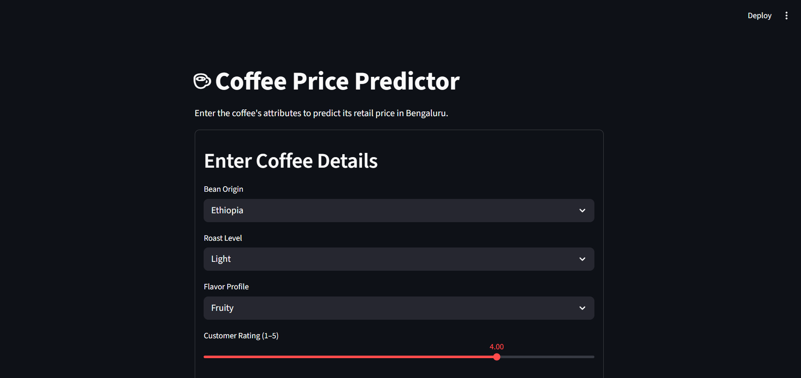
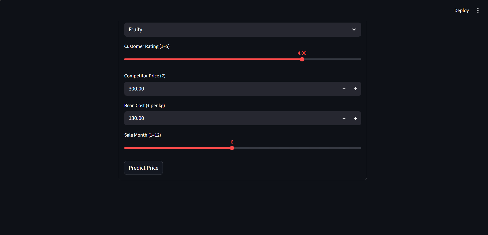

# ☕ Coffee Price Predictor

A complete machine learning project that predicts coffee prices based on product features, from data exploration in notebooks to a live demo in a Streamlit web app.

---

## 🚀 Live Demo
*A snapshot of the prediction interface in Bengaluru.*

> 
> 


---

## 🔧 Tech Stack

* **Python 3.10+**
* **Data Manipulation:** Pandas, NumPy
* **Machine Learning:** Scikit-learn
* **Web App:** Streamlit
* **Experimentation:** Jupyter Notebook

---

## 📂 Project Structure

The project is structured to separate experimentation, model training, and the final application, which is a standard practice for maintainable data science projects.

├── app/
│   └── app.py              # The Streamlit web application script.
│
├── data/
│   └── coffee_data.csv     # The raw dataset used for training (add your CSV here).
│
├── models/
│   └── coffee_price_predictor_pipeline.pkl # The final, serialized ML pipeline.
│
├── notebooks/
│   ├── EDA.ipynb           # Exploratory Data Analysis and visualization.
│   └── Modelling.ipynb     # Model experimentation and final pipeline creation.
│
├── src/
│   └── train_model.py      # A clean script to train the model and save the pipeline.
│
├── .gitignore              # Specifies files for Git to ignore.
├── README.md               # You are here!
└── requirements.txt        # A list of all Python packages required to run the project.


---

## ⚙️ How to Run Locally

Follow these steps to set up and run the project on your local machine.

#### **1. Clone the Repository**
```bash
git clone [https://github.com/your-username/Coffee-Price-Predictor.git](https://github.com/your-username/Coffee-Price-Predictor.git)
cd Coffee-Price-Predictor
2. Create and Activate a Virtual Environment
It's recommended to create a virtual environment to keep dependencies isolated.

On Windows (PowerShell):

PowerShell

python -m venv .venv
.venv\Scripts\Activate.ps1
On macOS/Linux:

Bash

python3 -m venv .venv
source .venv/bin/activate
3. Install Dependencies
Install all the required packages from the requirements.txt file.

Bash

pip install -r requirements.txt
4. Train the Model
Before running the app, you need to train the model, which will create the .pkl file in the models/ directory.

Bash

python src/train_model.py
Note: Make sure your dataset is in the data/ folder and its name matches the one in the train_model.py script.

5. Run the Streamlit App
Now you can launch the web application!

Bash

streamlit run app/app.py
Open your web browser and navigate to the local URL provided by Streamlit (usually http://localhost:8501).

🎯 Model Performance
Fill this in! Add the key metrics from your model evaluation here.

Model: RandomForestRegressor

Mean Absolute Error (MAE): ₹XX.XX

R-squared (R²): 0.XX

🔮 Future Improvements
Hyperparameter Tuning: Use GridSearchCV or RandomizedSearchCV to find the optimal model parameters.

Get a Real Dataset: The current model is trained on a sample dataset. Using a larger, real-world dataset would improve performance and relevance.

CI/CD Pipeline: Implement a simple CI/CD pipeline using GitHub Actions to automatically test and deploy the application.